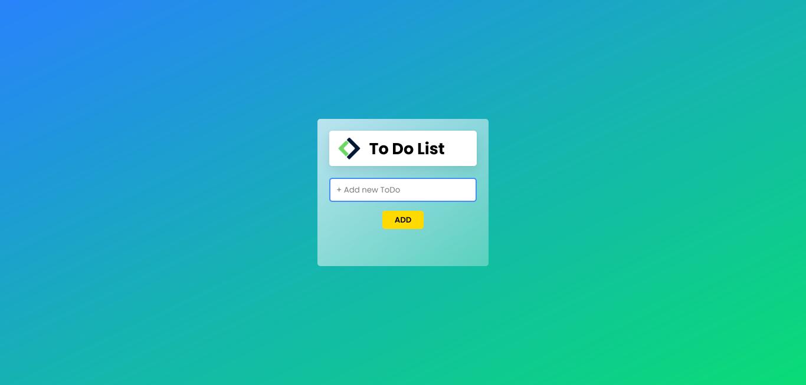

vue-todolist

Descrizione
Ricreare una todolist che permetta di aggiungere un todo e contrassegnarlo come completato mettendolo in fondo alla lista
Bonus
Modificare un elemento della lista, ricordandosi di aggiornare il title di quello giusto